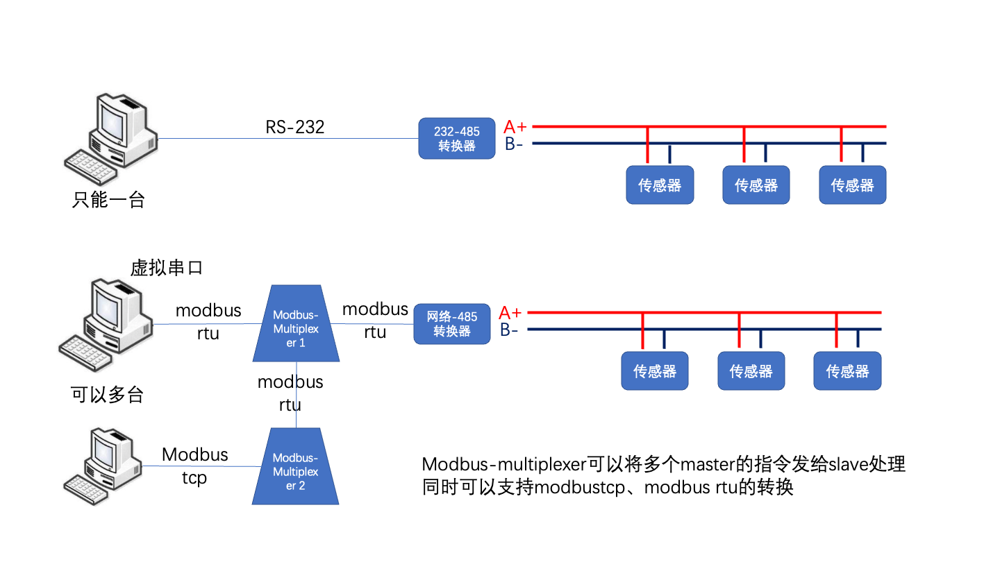

## modbus-multiplexer

modbus tcp/rtu to modbus tcp/rtu multiplxer gateway

```
modbus-multiplexer [ -s tcp | rtu ] [ -r tcp | rtu ] listen_port remote_ip remote_port

      -n name
      -d debug
      -s tcp_server type
      -r remote type
        tcp means modbustcp frame
        rtu means modbus rtu over tcp frame
```

listen at listen port, support multi client connect, send modbus packet to remote_ip:remote_port


在local_port接收TCP连接，通信使用modbus tcp/rtu 协议，转发到 remote_ip 的 remote_port，通信使用modbus tcp/rtu协议。


